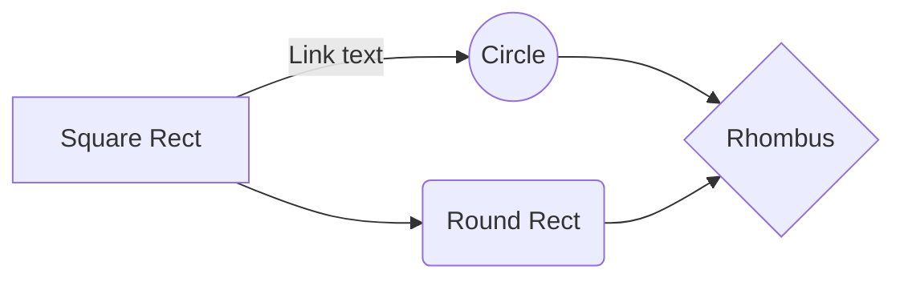

[```](index.html)

# Gameplay... 

> >Because how else are you going to play 🙃

## Gameplay :
*
*
*
*

## Winning conditions :

**Citizens win 😊**

* Citizens win by finding the cure
* * Finding cure and winning breakdown

* Citizens win by killing all the terrorists
* * Killing all the terrorists and winning breakdown

**Terrorists win 😢**

* Terrorists win when there are as many citizens alive as there are terrorists
* * Terrorists winning conditions breakdown

```
