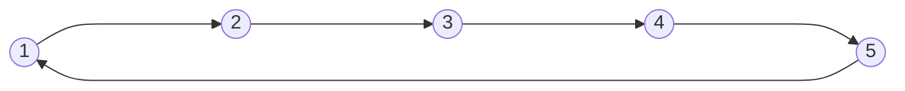
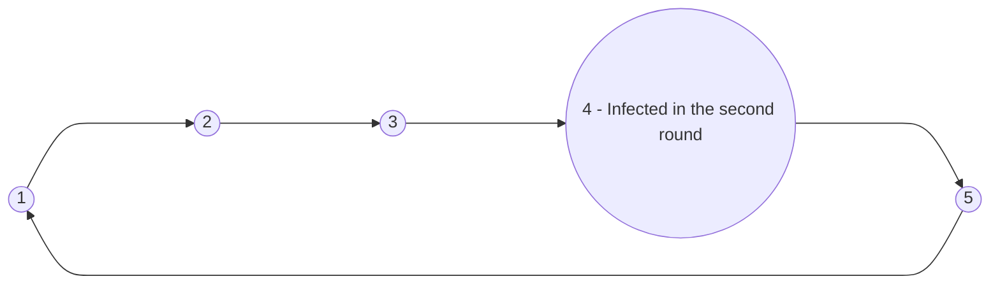
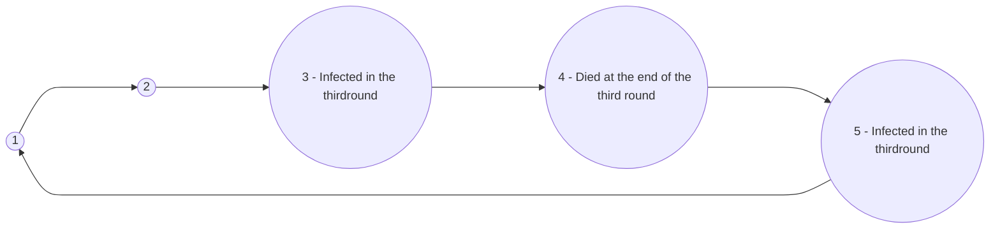
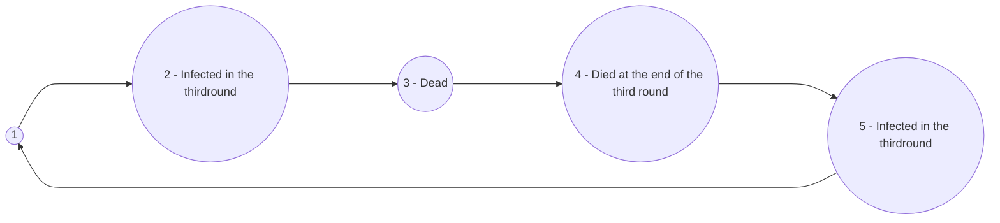
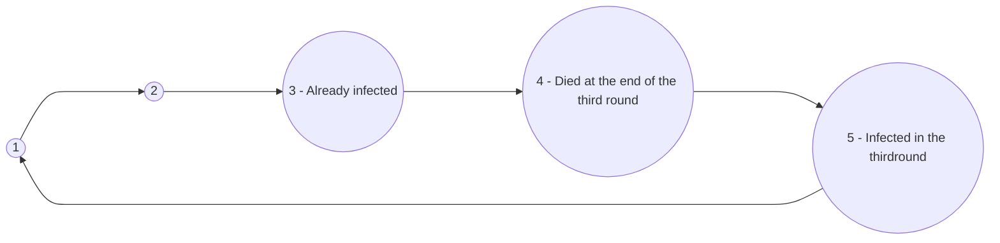
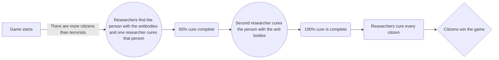
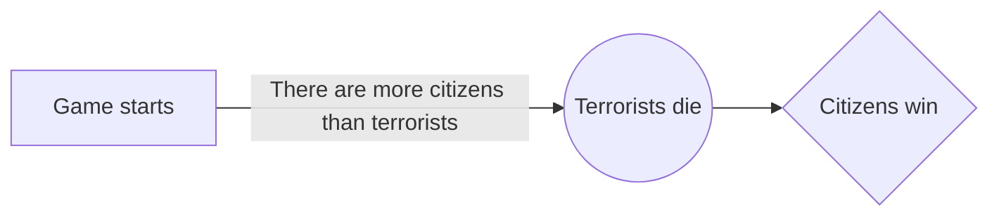
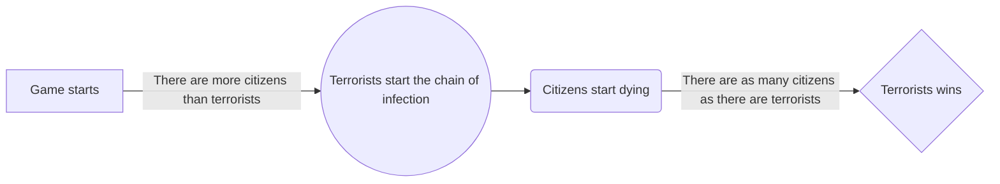

[```](index.html)

# Gameplay...

Because how else are you going to play? 🙃

## Gameplay:

Once upon a time, in the kingdom of Shrooms, the game will begin in the Colosseum room. All the players will spawn there and will go to the Angel Room where the angels will assign the roles of each player through cards. They'll get a character and a number that will decide their fate.

Now the game will begin in the Colosseum room with the gods' grace upon us, and the players have to argue for their lives.

There are three kinds of roles in this game: ordinary citizens, neutrals, and terrorists. In a nutshell:
- Ordinary citizens have to find the cure.
- Neutrals have their own agenda; they can are only concerned with accumulating points for themselves.
- Terrorists have to wreak havoc by starting the chain of infected players and, of course, survive.

At any point of the game, any player can leave the Colosseum and go to the Angel Room in order to:
- Ask any doubt from the angels.
- Strategize secretly with any other player.
- And if you're a researcher, to ask for a player's identity.

At the end of each round, the gods will announce the status of the cure and the number of infected players. At any point, if a player's death occurs, that player's identity will be revealed. 
After finding the cure, the citizens still need to cure themselves; otherwise, they'll die.
The gods will randomly bless an ordinary player with antibodies, and this player will be automatically cured after each round. The citizens and the researchers must work together in order to find this player with antibodies and find the cure. And the cure will be found in two stages by the researchers, as mentioned in their roles.

Game will be conducted in rounds of 10 minutes and will continue till either terrorists or ordinary citizens win.

## Chain of Infection
In the beginning each player will draw a character and a number randomly in the supervision of angels. The number sequnece goes like this and is representative of each player's positioning in the sequence of infection. Let's say there are 5 players in the game. Then the fifth and the first playert will be considered connected. This is how the sequence of players look like :

Once a player is infected that player has a one round buffer before dying and infecting the players on his immediate sides. Let's say the fourth player gets infected in the second round.

 The fourh player will die by the end of round three if that player is not cured by the end of the third round. Then the players on the immediate sides of the fourth player will be infected in the third round and will die by the end of the fourth round unless cured infecting the players on their respective immediate sides. 

This will  be the spread of infection :

Let's say the third player is dead. Then the second player will be infected when the fourth player dies. 

If the third player is already infected but not dead, then the second player will not be infected.

This spread of infection will continue till a cure is found or there are as many citizens as there are terrorists in which case the terrorists would have won.

## Winning Conditions:

**Citizens Win 😊**

- Citizens win by finding the cure.
  - If the researchers find a cure and everyone living except the terrorists are cured before, then the citizens win.



- Killing all the terrorists 😎:
  - The citizens can also win if all the terrorists are dead before there are as any citizens in the game as there are terrorists at that point of time in the game.

**Terrorists Win 😢**

-   Terrorists win when there are as many citizens alive as there are terrorists at any point of time in the game.
    -   Between all the terrorists the terrorists have a single  vile of virus and a single vile of antidote. The terrorists can't get infected by thier own virus. They can  use the vile on antidote to instantly heal any player. Apart from this each terrorist also has one bullet each. They have to use these resources to kill as many citizens as possible without getting caught.

```
